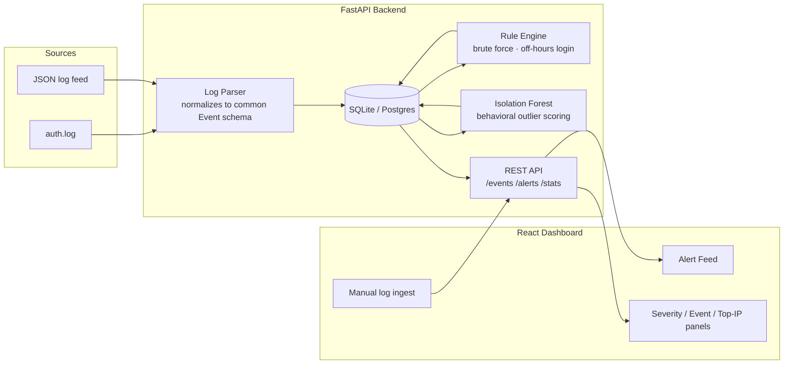

# SIEM-lite

**Repo:** https://github.com/takshp2024-sys/siem-lite

A lightweight Security Information and Event Management (SIEM) platform that ingests raw security logs, normalizes them into a common schema, and detects threats using both **rule-based signatures** and a **statistical anomaly model (Isolation Forest)** — the same modeling approach used in my Robot Sensor Anomaly Detector (F1=0.82, ROC-AUC=0.89), adapted here to login behavior instead of sensor telemetry.

Built to demonstrate practical SOC-style detection engineering: log normalization, rule authoring, ML-based behavioral outlier detection, and a real-time analyst dashboard.

---

## Why both rule-based and ML detection?

A real SOC runs both, and understanding *why* is the point of this project:

| | Rule-based | Isolation Forest (ML) |
|---|---|---|
| Catches | Known attack signatures (brute force, off-hours logins) | Behavioral outliers with no predefined signature |
| Speed | Instant, deterministic | Requires enough baseline data to model "normal" |
| Weakness | Blind to anything not explicitly written | Can flag legitimate-but-unusual behavior (false positives) |

Running both layers means known attacks are caught immediately, while novel or slow-and-low activity that doesn't match any rule still has a chance of surfacing.

---

## Architecture



*(Rendered directly by GitHub — no external image needed. See [`docs/architecture-notes.md`](docs/architecture-notes.md) for a deeper breakdown of each stage, and drop a static export here if you want a non-Mermaid version for a slide deck.)*

---

## Stack

- **Backend:** FastAPI, SQLAlchemy, SQLite (swappable for Postgres via `DATABASE_URL`), scikit-learn
- **Frontend:** React + Vite, Recharts
- **Detection:** custom rule engine (sliding-window brute-force detection, off-hours login flagging) + Isolation Forest anomaly scoring on per-IP login behavior
- **Deployment:** Docker Compose (backend + frontend as separate containers)

---

## Quickstart

### Option A — Docker Compose (recommended)

```bash
git clone <this-repo>
cd siem-lite
docker compose up --build
```

- Dashboard: http://localhost:5173
- API docs (Swagger): http://localhost:8000/docs

### Option B — Run locally without Docker

**Backend:**
```bash
cd backend
pip install -r requirements.txt
uvicorn app.main:app --reload
```

**Frontend:**
```bash
cd frontend
npm install
npm run dev
```

### Load demo data

The dashboard starts empty. Generate and ingest a synthetic `auth.log` that includes a real embedded brute-force burst and an off-hours login:

```bash
cd backend/sample_logs
python generate_sample_log.py > sample_auth.log

curl -X POST http://localhost:8000/ingest/file \
  -F "fmt=auth_log" \
  -F "file=@sample_auth.log"
```

Refresh the dashboard — you should see three alerts fire: a `brute_force_ssh` rule alert, an `off_hours_login` rule alert, and an `isolation_forest_outlier` ML alert, all correctly attributing the same attacker IP.

---

## API Reference

| Endpoint | Method | Description |
|---|---|---|
| `/ingest/text` | POST | Ingest raw log lines from a JSON body |
| `/ingest/file` | POST | Ingest an uploaded log file |
| `/ingest/rescan` | POST | Re-run detection over existing data without new ingestion |
| `/events` | GET | List normalized events (filterable by type, source IP) |
| `/alerts` | GET | List generated alerts (filterable by severity, detector) |
| `/stats/summary` | GET | Aggregate stats for dashboard charts |

Full interactive docs at `/docs` (Swagger UI, auto-generated by FastAPI).

---

## Detection logic

**Rule-based (`app/detection/rules.py`)**
- `brute_force_ssh` — flags a source IP with 5+ failed logins within a 5-minute sliding window
- `off_hours_login` — flags successful logins between 00:00–05:00

**ML-based (`app/detection/anomaly.py`)**
- Builds a feature vector per source IP: total event count, failed-login ratio, distinct users attempted, mean time between events, and standard deviation of login hour
- Fits an Isolation Forest (`contamination=0.1`) and flags IPs scored as outliers
- Requires a minimum of 20 events before running, since Isolation Forest needs enough data to establish a baseline of "normal"

Both thresholds are tunable constants at the top of each file — documented there rather than buried in logic, since threshold tuning is itself a real SOC operating decision.

---

## Project structure

```
siem-lite/
├── backend/
│   ├── app/
│   │   ├── detection/       # rules.py, anomaly.py
│   │   ├── models/          # SQLAlchemy Event, Alert models
│   │   ├── routers/         # ingest, events, stats
│   │   ├── log_parser.py    # auth.log + JSON normalization
│   │   ├── database.py
│   │   ├── schemas.py
│   │   └── main.py
│   ├── sample_logs/
│   │   └── generate_sample_log.py
│   └── requirements.txt
├── frontend/
│   ├── src/
│   │   ├── components/      # StatusBar, AlertFeed, StatsPanels, IngestPanel
│   │   ├── lib/api.js
│   │   └── App.jsx
│   └── package.json
├── docs/
│   └── architecture-notes.md
└── docker-compose.yml
```

---

## Limitations & what I'd add next

Being upfront about this matters more than pretending it's production-ready:

- **Single-node only.** No log shipping agent (Filebeat/Fluentd) — logs are ingested via direct upload for demo purposes. A real deployment would need an agent-based collection pipeline.
- **Isolation Forest retrains on every detection pass** rather than being persisted and incrementally updated — fine for a demo dataset, not for production log volume.
- **No authentication on the API** — every endpoint is open. Given more time, this is exactly where the RBAC-secured Vulnerability API (planned) project's JWT pattern would get reused.
- **Rule thresholds are static constants**, not configurable per-environment through the UI.

## Author

**Taksh** — Computer Science Honours, York University · [GitHub](https://github.com/takshp2024-sys)
Built alongside a Robot Sensor Anomaly Detector (PyTorch LSTM Autoencoder + Isolation Forest) — this project reuses the same anomaly-detection instincts applied to security log data.
